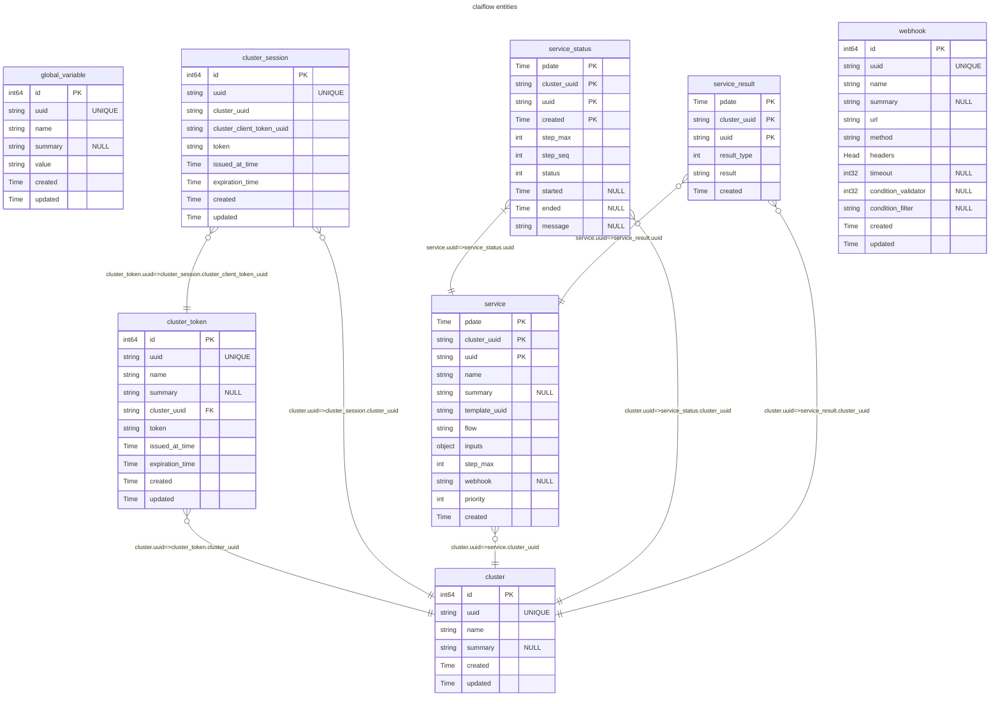

# Entity Relationship Diagram

```mermaid
---
title: claiflow entities
---
erDiagram
    global_variable {
        int64 id PK
        string uuid "UNIQUE"
        string name 
        string summary "NULL"
        string value 
        Time created
        Time updated
    }

    cluster {
        int64 id PK
        string uuid "UNIQUE"
        string name 
        string summary "NULL"
        Time created
        Time updated
    }

    cluster_token {
        int64 id PK
        string uuid "UNIQUE"
        string name 
        string summary "NULL"
        string cluster_uuid FK
        string token
        Time issued_at_time
        Time expiration_time
        Time created
        Time updated
    }

    cluster_token }o--|| cluster : "cluster.uuid=>cluster_token.cluster_uuid"

    cluster_session {
        int64 id PK
        string uuid "UNIQUE"
        string cluster_uuid
        string cluster_client_token_uuid
        string token
        Time issued_at_time
        Time expiration_time
        Time created
        Time updated
    }

    cluster_session }o--|| cluster : "cluster.uuid=>cluster_session.cluster_uuid"

    cluster_session }o--|| cluster_token : "cluster_token.uuid=>cluster_session.cluster_client_token_uuid"

    service {
        Time pdate PK
        string cluster_uuid PK
        string uuid PK
        string name
        string summary "NULL"
        string template_uuid
        string flow
        object inputs
        int step_max
        string webhook "NULL"
        int priority
        Time created
    }

    service }o--|| cluster : "cluster.uuid=>service.cluster_uuid"

    service_status {
        Time pdate PK
        string cluster_uuid PK
        string uuid PK
        Time created PK
        int step_max
        int step_seq
        int status
        Time started "NULL"
        Time ended "NULL"
        string message "NULL"
    }

    service_status }o--|| cluster : "cluster.uuid=>service_status.cluster_uuid"

    service_status }|--|| service : "service.uuid=>service_status.uuid"

    service_result {
        Time pdate PK
        string cluster_uuid PK
        string uuid PK
        int result_type
        string result
        Time created
    }

    service_result }o--|| cluster : "cluster.uuid=>service_result.cluster_uuid"

    service_result }o--|| service : "service.uuid=>service_result.uuid"

    webhook {
        int64 id PK
        string uuid "UNIQUE"
        string name
        string summary "NULL"
        string url
        string method
        Head headers 
        int32 timeout "NULL"
        int32 condition_validator "NULL"
        string condition_filter "NULL"
        Time created
        Time updated
    }

```
